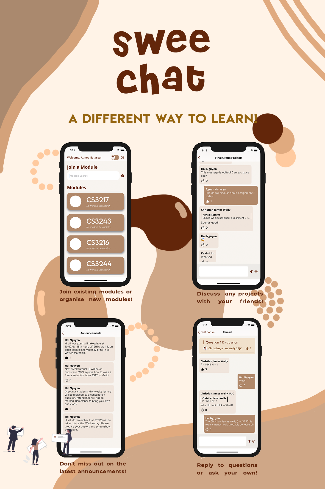

# Sweechat

SweeChat is an iOS messaging application that aims to foster the development of encouraging education communities. This project is built as part of the final project of [CS3217](https://cs3217.github.io/cs3217-docs/final-project-guidelines/final-project-requirements/). We were given the freedom to build anything we wanted and decided to create a messaging app from scratch. This was a great learning experience for us.

SweeChat was built on the Model-View-ViewModel (MVVM) software architectural pattern. Notable engineering feats include cryptography, notifications, media caching, and message pagination.

## Setup
You will need to set up a Firebase environment with notifications enabled and add the GoogleService-Info.plist file to the Sweechat folder before being able to build and run the app. An Apple developer account is required to turn on push notifications.
