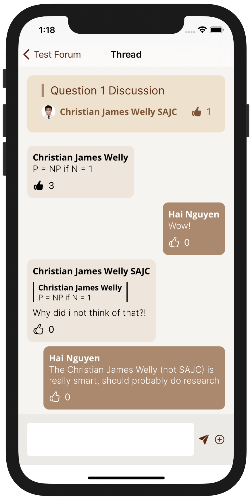

# Sweechat

Sweechat is an iOS messaging app that aims to foster the development of encouraging education communities. We were given the freedom to build anything we wanted and decided to create a messaging app from scratch. This was a great learning experience for us

Sweechat was built upon the Model-View-ViewModel (MVVM) software architectural pattern. Notable engineering feats include cryptography, notifications, media caching, and message pagination.

## Setup
You will need to set up a Firebase environment with notifications enabled and add the GoogleService-Info.plist file to the Sweechat folder before being able to build and run the app. An Apple developer account is required to turn on push notifications.
